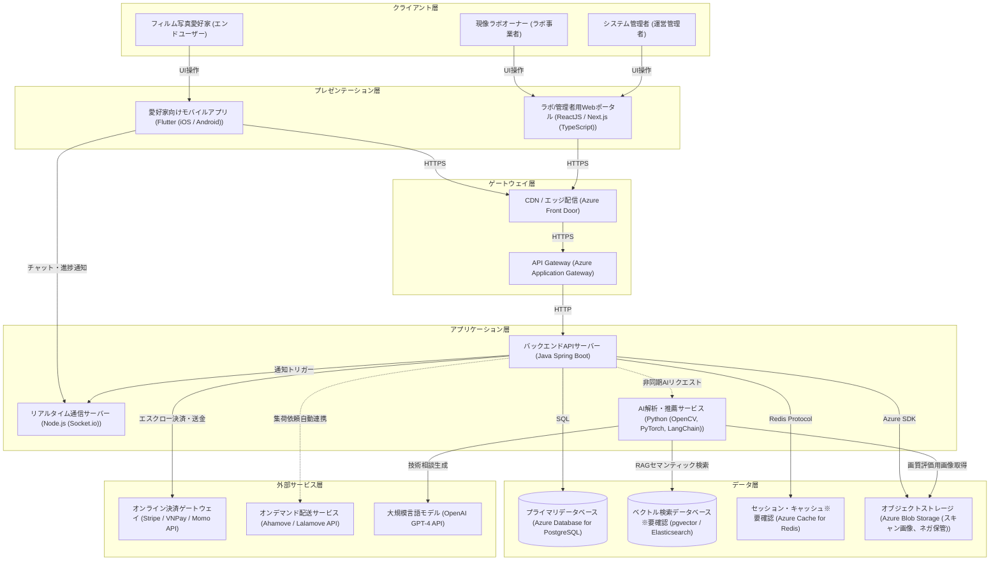

# アーキテクチャ構成図

フィルム写真愛好家と現像ラボを接続し、AIによる画像一次解析・RAGアシスタントを提供するプラットフォームのクラウド構成図

**クライアント層:**
- フィルム写真愛好家 [エンドユーザー]
- 現像ラボオーナー [ラボ事業者]
- システム管理者 [運営管理者]

**プレゼンテーション層:**
- 愛好家向けモバイルアプリ [Flutter (iOS / Android)]
- ラボ/管理者用Webポータル [ReactJS / Next.js (TypeScript)]

**ゲートウェイ層:**
- CDN / エッジ配信 [Azure Front Door]
- API Gateway [Azure Application Gateway]

**アプリケーション層:**
- バックエンドAPIサーバー [Java Spring Boot]
- リアルタイム通信サーバー [Node.js (Socket.io)]
- AI解析・推薦サービス [Python (OpenCV, PyTorch, LangChain)]

**データ層:**
- プライマリデータベース [Azure Database for PostgreSQL]
- ベクトル検索データベース※要確認 [pgvector / Elasticsearch]
- セッション・キャッシュ※要確認 [Azure Cache for Redis]
- オブジェクトストレージ [Azure Blob Storage (スキャン画像、ネガ保管)]

**外部サービス層:**
- オンライン決済ゲートウェイ [Stripe / VNPay / Momo API]
- オンデマンド配送サービス [Ahamove / Lalamove API]
- 大規模言語モデル [OpenAI GPT-4 API]

**接続:**
- フィルム写真愛好家 → 愛好家向けモバイルアプリ (UI操作)
- 現像ラボオーナー → ラボ/管理者用Webポータル (UI操作)
- システム管理者 → ラボ/管理者用Webポータル (UI操作)
- 愛好家向けモバイルアプリ → CDN / エッジ配信 (HTTPS)
- ラボ/管理者用Webポータル → CDN / エッジ配信 (HTTPS)
- 愛好家向けモバイルアプリ → リアルタイム通信サーバー (WSS)
- CDN / エッジ配信 → API Gateway (HTTPS)
- API Gateway → バックエンドAPIサーバー (HTTP)
- バックエンドAPIサーバー → リアルタイム通信サーバー (gRPC)
- バックエンドAPIサーバー → AI解析・推薦サービス (HTTP)
- バックエンドAPIサーバー → プライマリデータベース (SQL)
- バックエンドAPIサーバー → セッション・キャッシュ※要確認 (Redis Protocol)
- バックエンドAPIサーバー → オブジェクトストレージ (Azure SDK)
- AI解析・推薦サービス → ベクトル検索データベース※要確認 (HTTP/SQL)
- AI解析・推薦サービス → 大規模言語モデル (HTTPS)
- AI解析・推薦サービス → オブジェクトストレージ (Azure SDK)
- バックエンドAPIサーバー → オンライン決済ゲートウェイ (HTTPS)
- バックエンドAPIサーバー → オンデマンド配送サービス (HTTPS)

