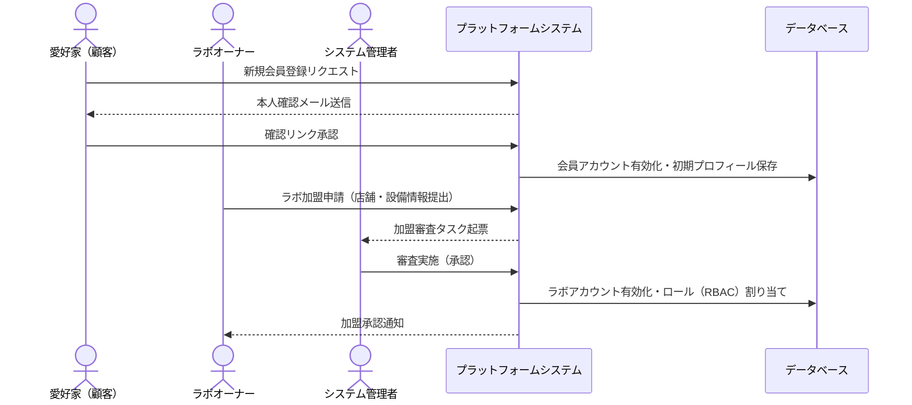
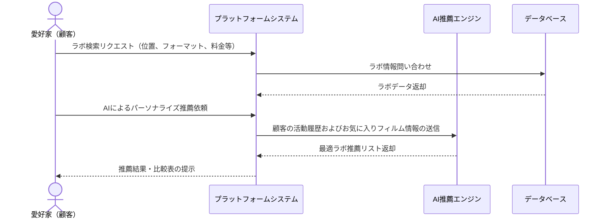
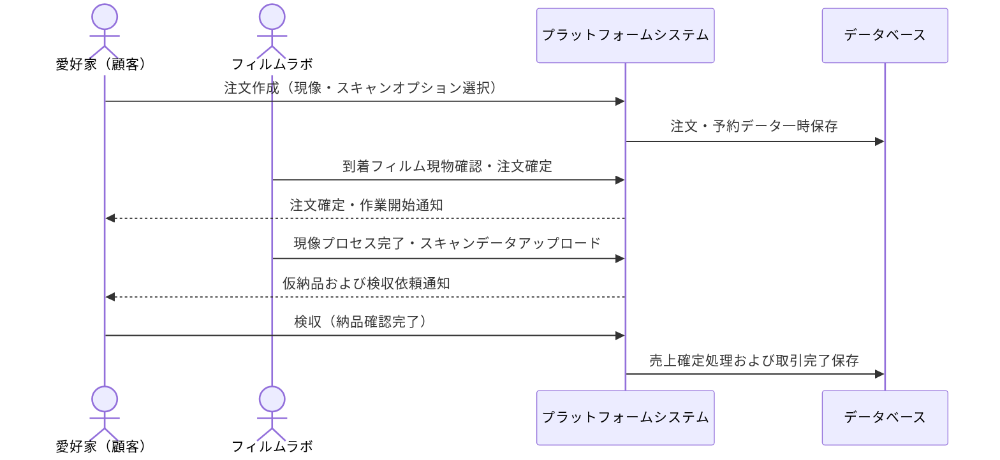
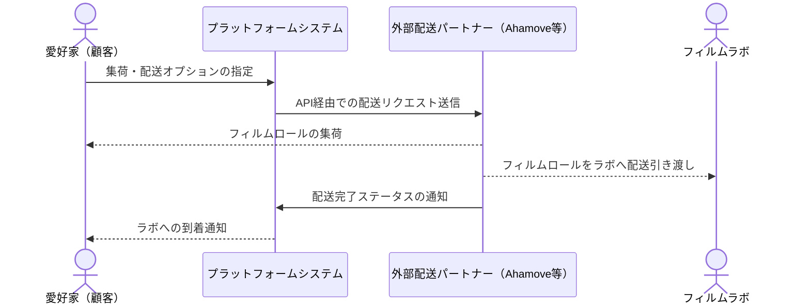
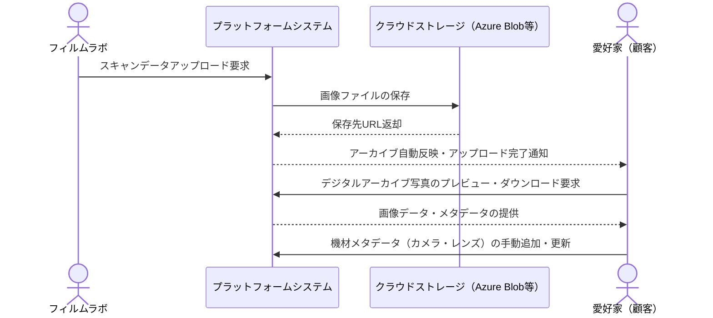
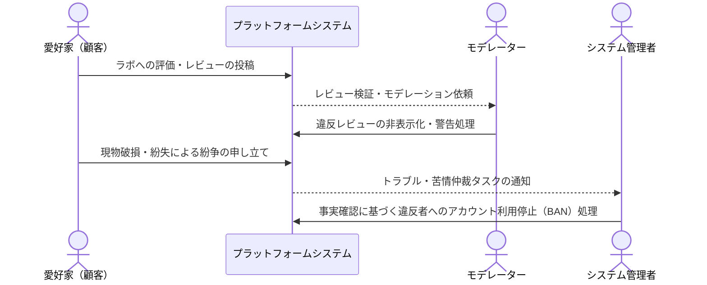
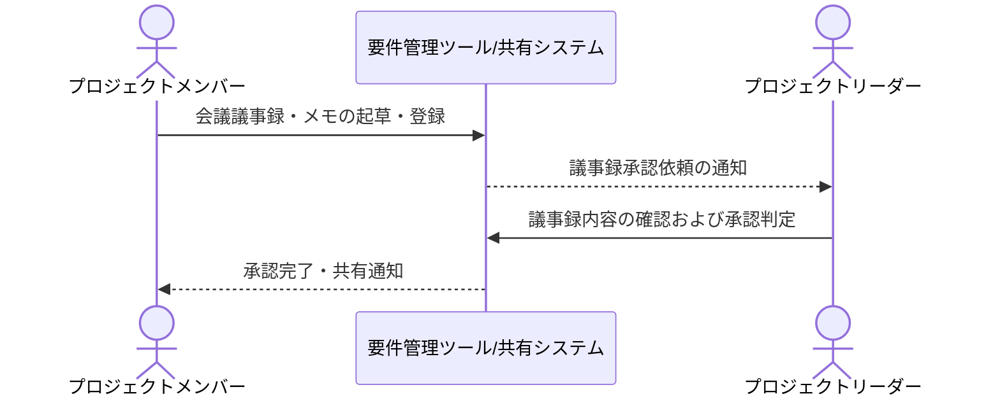
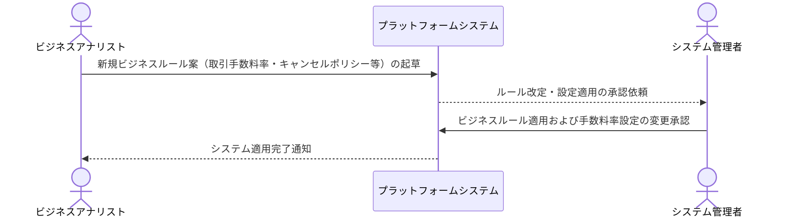
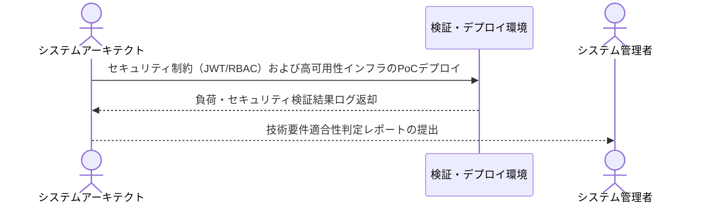
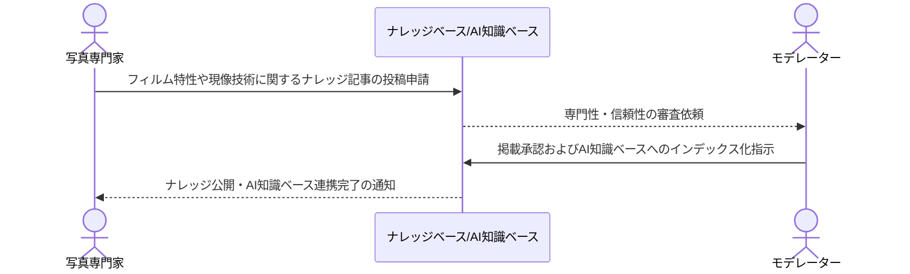

# 業務フロー

## 会員・アカウント管理

愛好家やラボオーナー等の新規登録から、本人確認、ロール割り当て、承認までの一連の管理フロー

**参加者:** 愛好家（顧客） (actor)、ラボオーナー (actor)、システム管理者 (actor)、プラットフォームシステム (system)、データベース (database)

**メッセージフロー:**
- 愛好家（顧客） → プラットフォームシステム: 新規会員登録リクエスト
- プラットフォームシステム → 愛好家（顧客）: 本人確認メール送信
- 愛好家（顧客） → プラットフォームシステム: 確認リンク承認
- プラットフォームシステム → データベース: 会員アカウント有効化・初期プロフィール保存
- ラボオーナー → プラットフォームシステム: ラボ加盟申請（店舗・設備情報提出）
- プラットフォームシステム → システム管理者: 加盟審査タスク起票
- システム管理者 → プラットフォームシステム: 審査実施（承認）
- プラットフォームシステム → データベース: ラボアカウント有効化・ロール（RBAC）割り当て
- プラットフォームシステム → ラボオーナー: 加盟承認通知

## ラボ検索・推薦管理

複数の条件による検索やAI推薦、セマンティック検索を用いて、愛好家に最適な現像ラボを推薦・比較するフロー

**参加者:** 愛好家（顧客） (actor)、プラットフォームシステム (system)、AI推薦エンジン (system)、データベース (database)

**メッセージフロー:**
- 愛好家（顧客） → プラットフォームシステム: ラボ検索リクエスト（位置、フォーマット、料金等）
- プラットフォームシステム → データベース: ラボ情報問い合わせ
  - データベース ← プラットフォームシステム: ラボデータ返却
- 愛好家（顧客） → プラットフォームシステム: AIによるパーソナライズ推薦依頼
- プラットフォームシステム → AI推薦エンジン: 顧客の活動履歴およびお気に入りフィルム情報の送信
  - AI推薦エンジン ← プラットフォームシステム: 最適ラボ推薦リスト返却
  - プラットフォームシステム ← 愛好家（顧客）: 推薦結果・比較表の提示

## サービス予約・注文管理

注文作成からフィルム引き渡し、ラボでの現像工程、仮納品および検収、売上確定までの業務フロー

**参加者:** 愛好家（顧客） (actor)、フィルムラボ (actor)、プラットフォームシステム (system)、データベース (database)

**メッセージフロー:**
- 愛好家（顧客） → プラットフォームシステム: 注文作成（現像・スキャンオプション選択）
- プラットフォームシステム → データベース: 注文・予約データ一時保存
- フィルムラボ → プラットフォームシステム: 到着フィルム現物確認・注文確定
- プラットフォームシステム → 愛好家（顧客）: 注文確定・作業開始通知
- フィルムラボ → プラットフォームシステム: 現像プロセス完了・スキャンデータアップロード
- プラットフォームシステム → 愛好家（顧客）: 仮納品および検収依頼通知
- 愛好家（顧客） → プラットフォームシステム: 検収（納品確認完了）
- プラットフォームシステム → データベース: 売上確定処理および取引完了保存

## 配送・物流管理

顧客からの集荷依頼を受け、外部の配送パートナーを通じてフィルムをラボに配送しステータスを追跡するフロー

**参加者:** 愛好家（顧客） (actor)、プラットフォームシステム (system)、外部配送パートナー（Ahamove等） (external)、フィルムラボ (actor)

**メッセージフロー:**
- 愛好家（顧客） → プラットフォームシステム: 集荷・配送オプションの指定
- プラットフォームシステム → 外部配送パートナー（Ahamove等）: API経由での配送リクエスト送信
- 外部配送パートナー（Ahamove等） → 愛好家（顧客）: フィルムロールの集荷
- 外部配送パートナー（Ahamove等） → フィルムラボ: フィルムロールをラボへ配送引き渡し
- 外部配送パートナー（Ahamove等） → プラットフォームシステム: 配送完了ステータスの通知
- プラットフォームシステム → 愛好家（顧客）: ラボへの到着通知

## デジタルアーカイブ管理

現像済み写真のスキャンデータ保存、自動反映、プレビュー・ダウンロードおよびメタデータ管理フロー

**参加者:** フィルムラボ (actor)、プラットフォームシステム (system)、クラウドストレージ（Azure Blob等） (external)、愛好家（顧客） (actor)

**メッセージフロー:**
- フィルムラボ → プラットフォームシステム: スキャンデータアップロード要求
- プラットフォームシステム → クラウドストレージ（Azure Blob等）: 画像ファイルの保存
  - クラウドストレージ（Azure Blob等） ← プラットフォームシステム: 保存先URL返却
- プラットフォームシステム → 愛好家（顧客）: アーカイブ自動反映・アップロード完了通知
- 愛好家（顧客） → プラットフォームシステム: デジタルアーカイブ写真のプレビュー・ダウンロード要求
  - プラットフォームシステム ← 愛好家（顧客）: 画像データ・メタデータの提供
- 愛好家（顧客） → プラットフォームシステム: 機材メタデータ（カメラ・レンズ）の手動追加・更新

## プラットフォーム管理・モデレーション

ユーザーレビューやマーケットプレイス出品物の巡回監視、紛争仲裁および利用制限処理プロセス

**参加者:** 愛好家（顧客） (actor)、プラットフォームシステム (system)、モデレーター (actor)、システム管理者 (actor)

**メッセージフロー:**
- 愛好家（顧客） → プラットフォームシステム: ラボへの評価・レビューの投稿
- プラットフォームシステム → モデレーター: レビュー検証・モデレーション依頼
- モデレーター → プラットフォームシステム: 違反レビューの非表示化・警告処理
- 愛好家（顧客） → プラットフォームシステム: 現物破損・紛失による紛争の申し立て
- プラットフォームシステム → システム管理者: トラブル・苦情仲裁タスクの通知
- システム管理者 → プラットフォームシステム: 事実確認に基づく違反者へのアカウント利用停止（BAN）処理

## 議事録・会議メモ（※要確認）

※未提供情報による補完。プロジェクト内の意思決定ミーティング内容を記録し、チーム内で共有・承認する業務フロー

**参加者:** プロジェクトメンバー (actor)、要件管理ツール/共有システム (system)、プロジェクトリーダー (actor)

**メッセージフロー:**
- プロジェクトメンバー → 要件管理ツール/共有システム: 会議議事録・メモの起草・登録
- 要件管理ツール/共有システム → プロジェクトリーダー: 議事録承認依頼の通知
- プロジェクトリーダー → 要件管理ツール/共有システム: 議事録内容の確認および承認判定
- 要件管理ツール/共有システム → プロジェクトメンバー: 承認完了・共有通知

## 業務要件・ビジネスルール（※要確認）

※未提供情報による補完。ビジネスルールの策定や改定、プラットフォームシステムへの定義適用フロー

**参加者:** ビジネスアナリスト (actor)、プラットフォームシステム (system)、システム管理者 (actor)

**メッセージフロー:**
- ビジネスアナリスト → プラットフォームシステム: 新規ビジネスルール案（取引手数料率・キャンセルポリシー等）の起草
- プラットフォームシステム → システム管理者: ルール改定・設定適用の承認依頼
- システム管理者 → プラットフォームシステム: ビジネスルール適用および手数料率設定の変更承認
  - プラットフォームシステム ← ビジネスアナリスト: システム適用完了通知

## 技術要件・技術制約（※要確認）

※未提供情報による補完。JWT認証・RBAC等のセキュリティ設計、およびクラウド技術制約（Azure）の検証フロー

**参加者:** システムアーキテクト (actor)、検証・デプロイ環境 (system)、システム管理者 (actor)

**メッセージフロー:**
- システムアーキテクト → 検証・デプロイ環境: セキュリティ制約（JWT/RBAC）および高可用性インフラのPoCデプロイ
  - 検証・デプロイ環境 ← システムアーキテクト: 負荷・セキュリティ検証結果ログ返却
- システムアーキテクト → システム管理者: 技術要件適合性判定レポートの提出

## ドメイン知識（※要確認）

※未提供情報による補完。フィルムカメラや現像手法などの専門知識をプラットフォーム上のナレッジベースやAIアシスタントへ追加・承認するフロー

**参加者:** 写真専門家 (actor)、ナレッジベース/AI知識ベース (system)、モデレーター (actor)

**メッセージフロー:**
- 写真専門家 → ナレッジベース/AI知識ベース: フィルム特性や現像技術に関するナレッジ記事の投稿申請
- ナレッジベース/AI知識ベース → モデレーター: 専門性・信頼性の審査依頼
- モデレーター → ナレッジベース/AI知識ベース: 掲載承認およびAI知識ベースへのインデックス化指示
- ナレッジベース/AI知識ベース → 写真専門家: ナレッジ公開・AI知識ベース連携完了の通知

