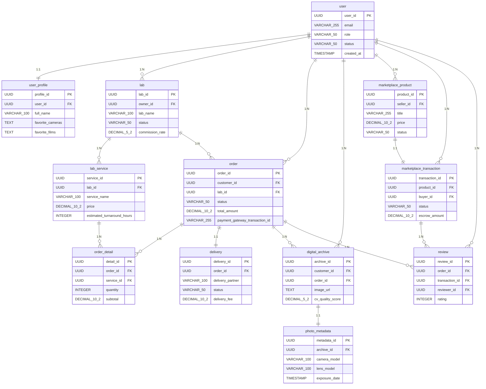

# ER図

フィルム写真愛好家とラボを繋ぐAIプラットフォームのER図。※要確認：議事録、業務要件、技術要件、ドメイン知識のコンテキストが未提供のため、一部手数料率や配送モデルは推測で設計しており、詳細なビジネスロジックは「未定義」となっています。

### エンティティ一覧

**USER**

| カラム名 | データ型 | キー |
| --- | --- | --- |
| user_id | UUID | PK |
| email | VARCHAR(255) |  |
| role | VARCHAR(50) |  |
| status | VARCHAR(50) |  |
| created_at | TIMESTAMP |  |

**USER_PROFILE**

| カラム名 | データ型 | キー |
| --- | --- | --- |
| profile_id | UUID | PK |
| user_id | UUID | FK |
| full_name | VARCHAR(100) |  |
| favorite_cameras | TEXT |  |
| favorite_films | TEXT |  |

**LAB**

| カラム名 | データ型 | キー |
| --- | --- | --- |
| lab_id | UUID | PK |
| owner_id | UUID | FK |
| lab_name | VARCHAR(100) |  |
| status | VARCHAR(50) |  |
| commission_rate | DECIMAL(5,2) |  |

**LAB_SERVICE**

| カラム名 | データ型 | キー |
| --- | --- | --- |
| service_id | UUID | PK |
| lab_id | UUID | FK |
| service_name | VARCHAR(100) |  |
| price | DECIMAL(10,2) |  |
| estimated_turnaround_hours | INTEGER |  |

**ORDER**

| カラム名 | データ型 | キー |
| --- | --- | --- |
| order_id | UUID | PK |
| customer_id | UUID | FK |
| lab_id | UUID | FK |
| status | VARCHAR(50) |  |
| total_amount | DECIMAL(10,2) |  |
| payment_gateway_transaction_id | VARCHAR(255) |  |

**ORDER_DETAIL**

| カラム名 | データ型 | キー |
| --- | --- | --- |
| detail_id | UUID | PK |
| order_id | UUID | FK |
| service_id | UUID | FK |
| quantity | INTEGER |  |
| subtotal | DECIMAL(10,2) |  |

**DELIVERY**

| カラム名 | データ型 | キー |
| --- | --- | --- |
| delivery_id | UUID | PK |
| order_id | UUID | FK |
| delivery_partner | VARCHAR(100) |  |
| status | VARCHAR(50) |  |
| delivery_fee | DECIMAL(10,2) |  |

**DIGITAL_ARCHIVE**

| カラム名 | データ型 | キー |
| --- | --- | --- |
| archive_id | UUID | PK |
| customer_id | UUID | FK |
| order_id | UUID | FK |
| image_url | TEXT |  |
| cv_quality_score | DECIMAL(5,2) |  |

**PHOTO_METADATA**

| カラム名 | データ型 | キー |
| --- | --- | --- |
| metadata_id | UUID | PK |
| archive_id | UUID | FK |
| camera_model | VARCHAR(100) |  |
| lens_model | VARCHAR(100) |  |
| exposure_date | TIMESTAMP |  |

**MARKETPLACE_PRODUCT**

| カラム名 | データ型 | キー |
| --- | --- | --- |
| product_id | UUID | PK |
| seller_id | UUID | FK |
| title | VARCHAR(255) |  |
| price | DECIMAL(10,2) |  |
| status | VARCHAR(50) |  |

**MARKETPLACE_TRANSACTION**

| カラム名 | データ型 | キー |
| --- | --- | --- |
| transaction_id | UUID | PK |
| product_id | UUID | FK |
| buyer_id | UUID | FK |
| status | VARCHAR(50) |  |
| escrow_amount | DECIMAL(10,2) |  |

**REVIEW**

| カラム名 | データ型 | キー |
| --- | --- | --- |
| review_id | UUID | PK |
| order_id | UUID | FK |
| transaction_id | UUID | FK |
| reviewer_id | UUID | FK |
| rating | INTEGER |  |

### リレーション

- USER → USER_PROFILE (1:1)
- USER → LAB (1:N)
- LAB → LAB_SERVICE (1:N)
- USER → ORDER (1:N)
- LAB → ORDER (1:N)
- ORDER → ORDER_DETAIL (1:N)
- LAB_SERVICE → ORDER_DETAIL (1:N)
- ORDER → DELIVERY (1:1)
- USER → DIGITAL_ARCHIVE (1:N)
- ORDER → DIGITAL_ARCHIVE (1:N)
- DIGITAL_ARCHIVE → PHOTO_METADATA (1:1)
- USER → MARKETPLACE_PRODUCT (1:N)
- MARKETPLACE_PRODUCT → MARKETPLACE_TRANSACTION (1:1)
- USER → MARKETPLACE_TRANSACTION (1:N)
- ORDER → REVIEW (1:N)
- MARKETPLACE_TRANSACTION → REVIEW (1:N)
- USER → REVIEW (1:N)

### ER図

