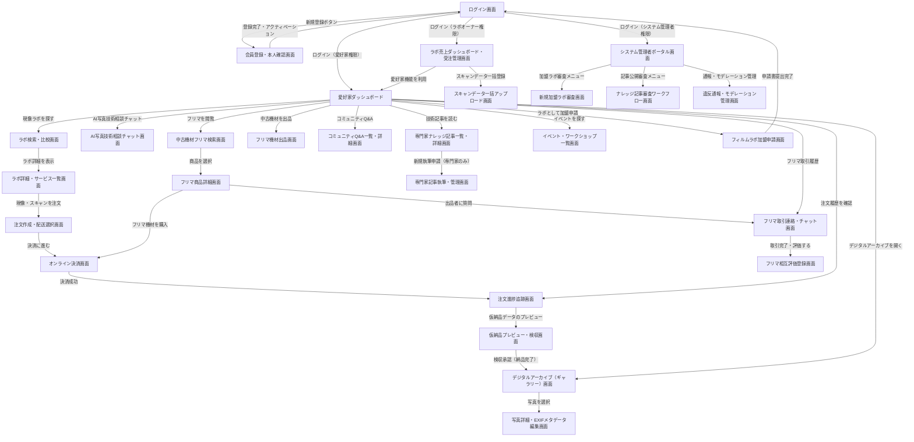

# 画面遷移

プラットフォーム全体の主要な画面遷移図。一般愛好家のラボ現像・デジタルアーカイブ利用・中古機材フリマ・コミュニティへのアクセスから、加盟ラボの受注管理、システム管理者による承認・モデレーション業務に至るまでのナビゲーションパスを定義しています。

**フロー:**
- ログイン画面 → 会員登録・本人確認画面 (新規登録ボタン)
- ログイン画面 → 愛好家ダッシュボード (ログイン（愛好家権限）)
- ログイン画面 → ラボ売上ダッシュボード・受注管理画面 (ログイン（ラボオーナー権限）)
- ログイン画面 → システム管理者ポータル画面 (ログイン（システム管理者権限）)
- 会員登録・本人確認画面 → ログイン画面 (登録完了・アクティベーション)
- 愛好家ダッシュボード → ラボ検索・比較画面 (現像ラボを探す)
- ラボ検索・比較画面 → ラボ詳細・サービス一覧画面 (ラボ詳細を表示)
- ラボ詳細・サービス一覧画面 → 注文作成・配送選択画面 (現像・スキャンを注文)
- 注文作成・配送選択画面 → オンライン決済画面 (決済に進む)
- オンライン決済画面 → 注文進捗追跡画面 (決済成功)
- 愛好家ダッシュボード → 注文進捗追跡画面 (注文履歴を確認)
- 注文進捗追跡画面 → 仮納品プレビュー・検収画面 (仮納品データのプレビュー)
- 仮納品プレビュー・検収画面 → デジタルアーカイブ（ギャラリー）画面 (検収承認（納品完了）)
- 愛好家ダッシュボード → デジタルアーカイブ（ギャラリー）画面 (デジタルアーカイブを開く)
- デジタルアーカイブ（ギャラリー）画面 → 写真詳細・EXIFメタデータ編集画面 (写真を選択)
- 愛好家ダッシュボード → AI写真技術相談チャット画面 (AI写真技術相談チャット)
- 愛好家ダッシュボード → 中古機材フリマ検索画面 (フリマを閲覧)
- 中古機材フリマ検索画面 → フリマ商品詳細画面 (商品を選択)
- フリマ商品詳細画面 → オンライン決済画面 (フリマ機材を購入)
- フリマ商品詳細画面 → フリマ取引連絡・チャット画面 (出品者に質問)
- 愛好家ダッシュボード → フリマ機材出品画面 (中古機材を出品)
- 愛好家ダッシュボード → フリマ取引連絡・チャット画面 (フリマ取引履歴)
- フリマ取引連絡・チャット画面 → フリマ相互評価登録画面 (取引完了・評価する)
- 愛好家ダッシュボード → コミュニティQ&A一覧・詳細画面 (コミュニティQ&A)
- 愛好家ダッシュボード → 専門家ナレッジ記事一覧・詳細画面 (技術記事を読む)
- 専門家ナレッジ記事一覧・詳細画面 → 専門家記事執筆・管理画面 (新規執筆申請（専門家のみ）)
- 愛好家ダッシュボード → イベント・ワークショップ一覧画面 (イベントを探す)
- 愛好家ダッシュボード → フィルムラボ加盟申請画面 (ラボとして加盟申請)
- フィルムラボ加盟申請画面 → ログイン画面 (申請書提出完了)
- ラボ売上ダッシュボード・受注管理画面 → スキャンデータ一括アップロード画面 (スキャンデータ一括登録)
- ラボ売上ダッシュボード・受注管理画面 → 愛好家ダッシュボード (愛好家機能を利用)
- システム管理者ポータル画面 → 新規加盟ラボ審査画面 (加盟ラボ審査メニュー)
- システム管理者ポータル画面 → ナレッジ記事審査ワークフロー画面 (記事公開審査メニュー)
- システム管理者ポータル画面 → 違反通報・モデレーション管理画面 (通報・モデレーション管理)

