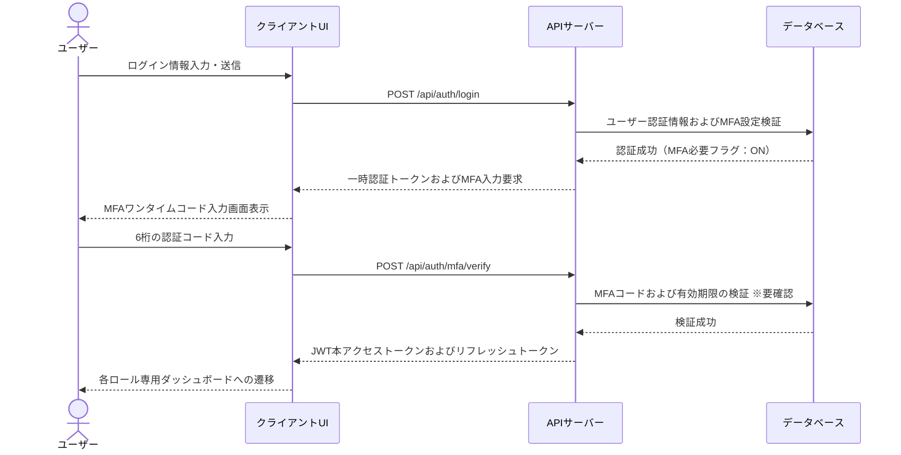
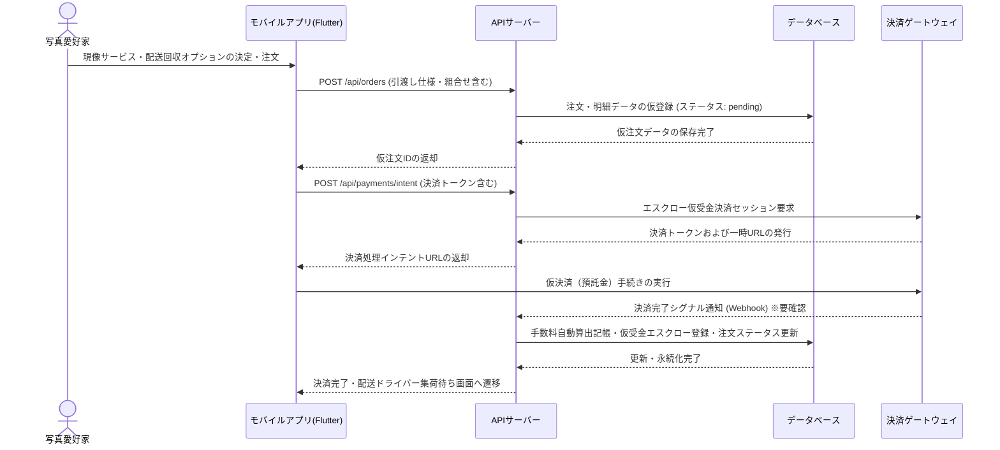
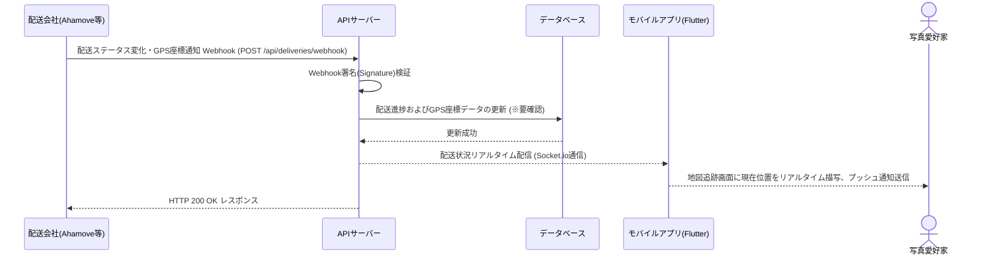
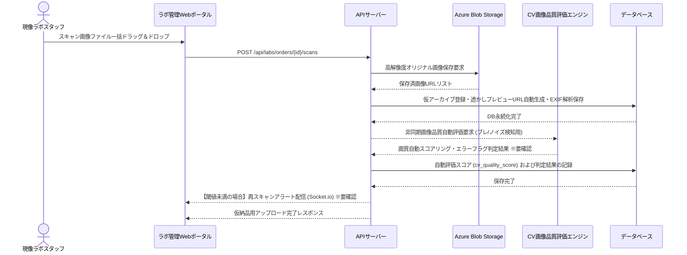
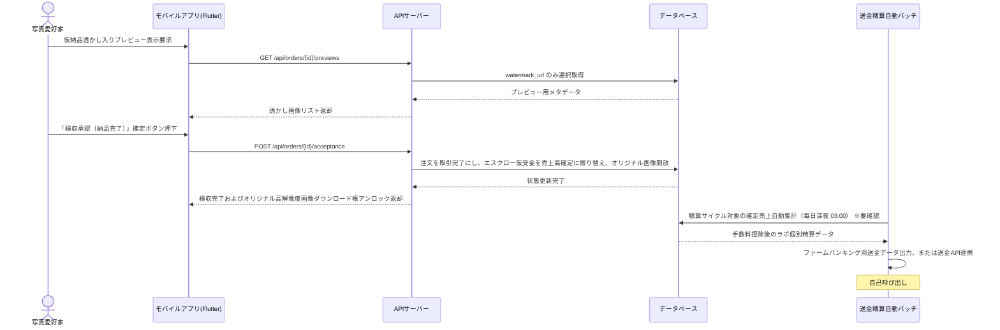
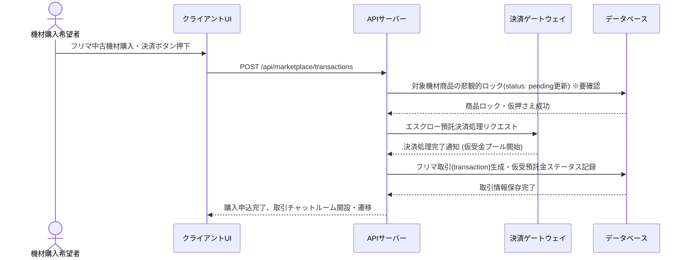
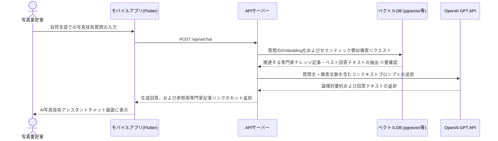
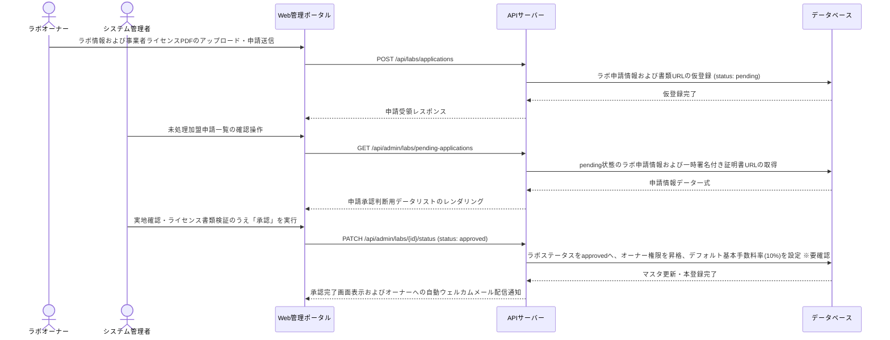

# シーケンス図

## ユーザー認証

一般愛好家およびラボオーナーが、パスワード認証およびワンタイムコード検証を経て、安全にセキュアなJWTトークンを取得する処理シーケンス。

**参加者:** ユーザー (actor)、クライアントUI (system)、APIサーバー (system)、データベース (database)

**メッセージフロー:**
- ユーザー → クライアントUI: ログイン情報入力・送信
- クライアントUI → APIサーバー: POST /api/auth/login
- APIサーバー → データベース: ユーザー認証情報およびMFA設定検証
  - データベース ← APIサーバー: 認証成功（MFA必要フラグ：ON）
  - APIサーバー ← クライアントUI: 一時認証トークンおよびMFA入力要求
  - クライアントUI ← ユーザー: MFAワンタイムコード入力画面表示
- ユーザー → クライアントUI: 6桁の認証コード入力
- クライアントUI → APIサーバー: POST /api/auth/mfa/verify
- APIサーバー → データベース: MFAコードおよび有効期限の検証 ※要確認
  - データベース ← APIサーバー: 検証成功
  - APIサーバー ← クライアントUI: JWT本アクセストークンおよびリフレッシュトークン
  - クライアントUI ← ユーザー: 各ロール専用ダッシュボードへの遷移

## データ登録

写真愛好家が仕様を指定して現像サービスを予約し、オンライン決済により代金を一時プール（エスクロー処理）するフロー。

**参加者:** 写真愛好家 (actor)、モバイルアプリ(Flutter) (system)、APIサーバー (system)、データベース (database)、決済ゲートウェイ (external)

**メッセージフロー:**
- 写真愛好家 → モバイルアプリ(Flutter): 現像サービス・配送回収オプションの決定・注文
- モバイルアプリ(Flutter) → APIサーバー: POST /api/orders (引渡し仕様・組合せ含む)
- APIサーバー → データベース: 注文・明細データの仮登録 (ステータス: pending)
  - データベース ← APIサーバー: 仮注文データの保存完了
  - APIサーバー ← モバイルアプリ(Flutter): 仮注文IDの返却
- モバイルアプリ(Flutter) → APIサーバー: POST /api/payments/intent (決済トークン含む)
- APIサーバー → 決済ゲートウェイ: エスクロー仮受金決済セッション要求
  - 決済ゲートウェイ ← APIサーバー: 決済トークンおよび一時URLの発行
  - APIサーバー ← モバイルアプリ(Flutter): 決済処理インテントURLの返却
- モバイルアプリ(Flutter) → 決済ゲートウェイ: 仮決済（預託金）手続きの実行
- 決済ゲートウェイ → APIサーバー: 決済完了シグナル通知 (Webhook) ※要確認
- APIサーバー → データベース: 手数料自動算出記帳・仮受金エスクロー登録・注文ステータス更新
  - データベース ← APIサーバー: 更新・永続化完了
  - APIサーバー ← モバイルアプリ(Flutter): 決済完了・配送ドライバー集荷待ち画面へ遷移

## 配送・外部連携

提携配送パートナーの配送状況の変動をWebhookでリアルタイム受信し、顧客にドライバー現在地を同期する連携処理フロー。

**参加者:** 配送会社(Ahamove等) (external)、APIサーバー (system)、データベース (database)、モバイルアプリ(Flutter) (system)、写真愛好家 (actor)

**メッセージフロー:**
- 配送会社(Ahamove等) → APIサーバー: 配送ステータス変化・GPS座標通知 Webhook (POST /api/deliveries/webhook)
- APIサーバー → APIサーバー: Webhook署名(Signature)検証
- APIサーバー → データベース: 配送進捗およびGPS座標データの更新 (※要確認)
  - データベース ← APIサーバー: 更新成功
- APIサーバー → モバイルアプリ(Flutter): 配送状況リアルタイム配信 (Socket.io通信)
  - モバイルアプリ(Flutter) ← 写真愛好家: 地図追跡画面に現在位置をリアルタイム描写、プッシュ通知送信
  - APIサーバー ← 配送会社(Ahamove等): HTTP 200 OK レスポンス

## データ登録

現像ラボがスキャン画像を一括登録した際、非同期でコンピュータビジョン(CV)による自動品質検査を行い、不備を一次判定する処理フロー。

**参加者:** 現像ラボスタッフ (actor)、ラボ管理Webポータル (system)、APIサーバー (system)、Azure Blob Storage (external)、CV画像品質評価エンジン (system)、データベース (database)

**メッセージフロー:**
- 現像ラボスタッフ → ラボ管理Webポータル: スキャン画像ファイル一括ドラッグ＆ドロップ
- ラボ管理Webポータル → APIサーバー: POST /api/labs/orders/{id}/scans
- APIサーバー → Azure Blob Storage: 高解像度オリジナル画像保存要求
  - Azure Blob Storage ← APIサーバー: 保存済画像URLリスト
- APIサーバー → データベース: 仮アーカイブ登録・透かしプレビューURL自動生成・EXIF解析保存
  - データベース ← APIサーバー: DB永続化完了
- APIサーバー → CV画像品質評価エンジン: 非同期画像品質自動評価要求 (ブレ/ノイズ検知用)
- CV画像品質評価エンジン → APIサーバー: 画質自動スコアリング・エラーフラグ判定結果 ※要確認
- APIサーバー → データベース: 自動評価スコア (cv_quality_score) および判定結果の記録
  - データベース ← APIサーバー: 保存完了
- APIサーバー → ラボ管理Webポータル: 【閾値未満の場合】再スキャンアラート配信 (Socket.io) ※要確認
  - APIサーバー ← ラボ管理Webポータル: 仮納品用アップロード完了レスポンス

## 決済処理

愛好家によるデジタルスキャン画像の検収承認に基づいて、取引を完了し、深夜バッチでラボへの売上を確定・送金する処理。

**参加者:** 写真愛好家 (actor)、モバイルアプリ(Flutter) (system)、APIサーバー (system)、データベース (database)、送金精算自動バッチ (system)

**メッセージフロー:**
- 写真愛好家 → モバイルアプリ(Flutter): 仮納品透かし入りプレビュー表示要求
- モバイルアプリ(Flutter) → APIサーバー: GET /api/orders/{id}/previews
- APIサーバー → データベース: watermark_url のみ選択取得
  - データベース ← APIサーバー: プレビュー用メタデータ
  - APIサーバー ← モバイルアプリ(Flutter): 透かし画像リスト返却
- 写真愛好家 → モバイルアプリ(Flutter): 「検収承認（納品完了）」確定ボタン押下
- モバイルアプリ(Flutter) → APIサーバー: POST /api/orders/{id}/acceptance
- APIサーバー → データベース: 注文を取引完了にし、エスクロー仮受金を売上高確定に振り替え、オリジナル画像開放
  - データベース ← APIサーバー: 状態更新完了
  - APIサーバー ← モバイルアプリ(Flutter): 検収完了およびオリジナル高解像度画像ダウンロード権アンロック返却
- 送金精算自動バッチ → データベース: 精算サイクル対象の確定売上自動集計（毎日深夜 03:00） ※要確認
  - データベース ← 送金精算自動バッチ: 手数料控除後のラボ個別精算データ
- 送金精算自動バッチ → 送金精算自動バッチ: ファームバンキング用送金データ出力、または送金API連携

## フリマ決済・取引

一般ユーザー間の中古カメラ等の売買取引において、安全に取引を仲介するエスクロー（仮受金）ワークフロー。

**参加者:** 機材購入希望者 (actor)、クライアントUI (system)、APIサーバー (system)、決済ゲートウェイ (external)、データベース (database)

**メッセージフロー:**
- 機材購入希望者 → クライアントUI: フリマ中古機材購入・決済ボタン押下
- クライアントUI → APIサーバー: POST /api/marketplace/transactions
- APIサーバー → データベース: 対象機材商品の悲観的ロック(status: pending更新) ※要確認
  - データベース ← APIサーバー: 商品ロック・仮押さえ成功
- APIサーバー → 決済ゲートウェイ: エスクロー預託決済処理リクエスト
  - 決済ゲートウェイ ← APIサーバー: 決済処理完了通知 (仮受金プール開始)
- APIサーバー → データベース: フリマ取引(transaction)生成・仮受預託金ステータス記録
  - データベース ← APIサーバー: 取引情報保存完了
  - APIサーバー ← クライアントUI: 購入申込完了、取引チャットルーム開設・遷移

## AIアシスタント

愛好家からの自然言語の疑問に対して、専門家の投稿したナレッジ記事や過去のベストQ&Aをセマンティック検索し、要約して回答するAIアシスタント連携フロー。

**参加者:** 写真愛好家 (actor)、モバイルアプリ(Flutter) (system)、APIサーバー (system)、ベクトルDB (pgvector等) (database)、OpenAI GPT API (external)

**メッセージフロー:**
- 写真愛好家 → モバイルアプリ(Flutter): 自然言語での写真技術質問の入力
- モバイルアプリ(Flutter) → APIサーバー: POST /api/ai/chat
- APIサーバー → ベクトルDB (pgvector等): 質問のEmbedding化およびセマンティック類似検索リクエスト
  - ベクトルDB (pgvector等) ← APIサーバー: 関連する専門家ナレッジ記事・ベスト回答テキストの抽出 ※要確認
- APIサーバー → OpenAI GPT API: 質問文 + 検索文脈を含むコンテキストプロンプトの送信
  - OpenAI GPT API ← APIサーバー: 論理的要約および回答テキストの返却
  - APIサーバー ← モバイルアプリ(Flutter): 生成回答、および参照用専門家記事リンクのセット返却
  - モバイルアプリ(Flutter) ← 写真愛好家: AI写真技術アシスタントチャット画面に表示

## マスタ管理

外部現像ラボがプラットフォームへの加盟申請書類をアップロードし、システム管理者の審査を経て、デフォルト手数料率と共に正式承認されるまでのフロー。

**参加者:** ラボオーナー (actor)、システム管理者 (actor)、Web管理ポータル (system)、APIサーバー (system)、データベース (database)

**メッセージフロー:**
- ラボオーナー → Web管理ポータル: ラボ情報および事業者ライセンスPDFのアップロード・申請送信
- Web管理ポータル → APIサーバー: POST /api/labs/applications
- APIサーバー → データベース: ラボ申請情報および書類URLの仮登録 (status: pending)
  - データベース ← APIサーバー: 仮登録完了
  - APIサーバー ← Web管理ポータル: 申請受領レスポンス
- システム管理者 → Web管理ポータル: 未処理加盟申請一覧の確認操作
- Web管理ポータル → APIサーバー: GET /api/admin/labs/pending-applications
- APIサーバー → データベース: pending状態のラボ申請情報および一時署名付き証明書URLの取得
  - データベース ← APIサーバー: 申請情報データ一式
  - APIサーバー ← Web管理ポータル: 申請承認判断用データリストのレンダリング
- システム管理者 → Web管理ポータル: 実地確認・ライセンス書類検証のうえ「承認」を実行
- Web管理ポータル → APIサーバー: PATCH /api/admin/labs/{id}/status (status: approved)
- APIサーバー → データベース: ラボステータスをapprovedへ、オーナー権限を昇格、デフォルト基本手数料率(10%)を設定 ※要確認
  - データベース ← APIサーバー: マスタ更新・本登録完了
  - APIサーバー ← Web管理ポータル: 承認完了画面表示およびオーナーへの自動ウェルカムメール配信通知

